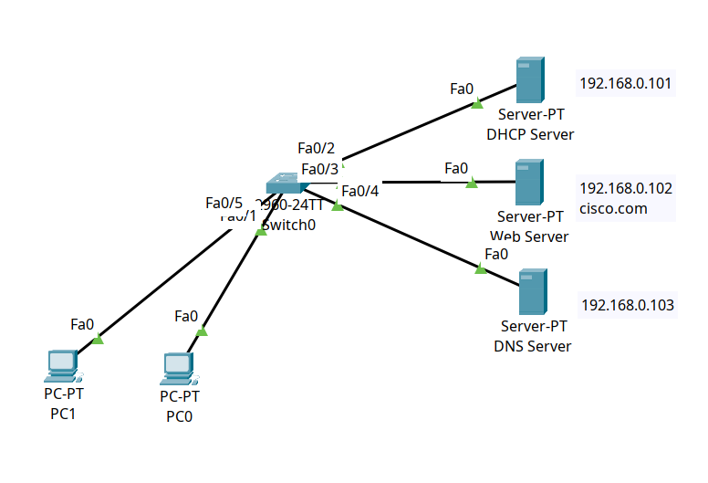

<div align="center">

# 🌐 Core Network Services: Integrated DHCP, DNS & HTTP Web Infrastructure

[](https://cisco.com)
[-brightgreen?style=for-the-badge)]()
[-orange?style=for-the-badge)]()
[-blueviolet?style=for-the-badge)]()
[]()

<p align="center">
  <b>Demonstrating the full end-to-end client initialization lifecycle across dedicated enterprise servers: dynamic IP lease acquisition (DHCP D.O.R.A), domain name resolution (DNS A-Record), and HTTP web page retrieval.</b>
</p>

</div>

---

## 📌 Executive Summary

Enterprise client workstations rely on seamless application-layer services to discover network parameters and access web applications. This lab demonstrates a complete, multi-server infrastructure operating across a Cisco Layer 2 switched fabric:
1. **Dynamic Addressing:** Clients (`PC0`, `PC1`) broadcast for an IP lease and dynamically receive their IP address (`192.168.0.51`), subnet mask, and DNS server address (`192.168.0.103`) via **DHCP**.
2. **Name Resolution:** Clients query the **DNS Server** (`192.168.0.103`) to resolve the domain name **`cisco.com`** into its physical IP address.
3. **Web Application Retrieval:** Clients establish a TCP connection with the **Web Server** (`192.168.0.102`) on port 80 to load and render the web application.

---

## 🗺️ Network Topology & Architecture

<div align="center">
  
</div>

---

## 📊 Infrastructure Service & Addressing Schema

| Server / Host | Interface | Static / Dynamic IP | Subnet Mask | Configured Service | Protocol / Port | Role & Configuration |
| :--- | :--- | :--- | :--- | :--- | :--- | :--- |
| **DHCP Server** | `Fa0` | `192.168.0.101` | `255.255.255.0` | **DHCP Pool** | UDP 67/68 | Leases `192.168.0.50 - .60`, hands out DNS `192.168.0.103` |
| **Web Server** | `Fa0` | `192.168.0.102` | `255.255.255.0` | **HTTP / HTTPS** | TCP 80 / 443 | Hosts web application content for `cisco.com` |
| **DNS Server** | `Fa0` | `192.168.0.103` | `255.255.255.0` | **DNS Service** | UDP 53 | Contains A-Record mapping: `cisco.com` → `192.168.0.102` |
| **PC0** | `NIC` | `192.168.0.51` (DHCP) | `255.255.255.0` | Client Workstation | N/A | Dynamic host with DNS set to `192.168.0.103` |
| **PC1** | `NIC` | *DHCP Assigned* | `255.255.255.0` | Client Workstation | N/A | Dynamic host |

---

## 🔄 End-to-End Client Lifecycle Workflow

```text
[ Step 1: DHCP Lease Negotiation ]
PC0 ─────── DHCP DISCOVER (Broadcast: 255.255.255.255) ───────> DHCP Server (192.168.0.101)
PC0 <────── DHCP OFFER (192.168.0.51 / Mask: /24)  ─────────── DHCP Server
PC0 ─────── DHCP REQUEST (Accepting 192.168.0.51) ────────────> DHCP Server
PC0 <────── DHCP ACK (Lease Granted + DNS Option: 192.168.0.103) ── DHCP Server

[ Step 2: Domain Name Resolution ]
PC0 ─────── DNS Query ("A Record for cisco.com") ─────────────> DNS Server (192.168.0.103)
PC0 <────── DNS Answer (cisco.com = 192.168.0.102) ─────────── DNS Server

[ Step 3: Web Application Retrieval ]
PC0 ─────── HTTP GET /index.html (TCP 80) ───────────────────> Web Server (192.168.0.102)
PC0 <────── HTTP 200 OK (HTML Payload Rendered) ────────────── Web Server
```

---

## 🛠️ Service Configurations

### 🔹 1. DHCP Server (`192.168.0.101`)
* **Service State:** `ON`
* **Pool Name:** `serverPool`
* **DNS Server:** `192.168.0.103`
* **Start IP Address:** `192.168.0.50`
* **Subnet Mask:** `255.255.255.0`
* **Max Number of Users:** `10`

### 🔹 2. DNS Server (`192.168.0.103`)
* **Service State:** `ON`
* **Resource Record Type:** `A Record`
* **Name:** `cisco.com`
* **Address:** `192.168.0.102`

### 🔹 3. HTTP Web Server (`192.168.0.102`)
* **Service State:** `HTTP: ON` | `HTTPS: ON`
* **Hosted Content:** Default Cisco HTML landing page and site assets.

---

## 🔍 Verification & Operational Proof

### 1. Client DHCP Lease Verification (`ipconfig`)
```text
C:\> ipconfig

FastEthernet0 Connection:
   IPv4 Address....................: 192.168.0.51
   Subnet Mask.....................: 255.255.255.0
   Default Gateway.................: 0.0.0.0
   DNS Server......................: 192.168.0.103
```

---

### 2. DNS Name Resolution Verification (`nslookup cisco.com`)
```text
C:\> nslookup cisco.com
Server:  [192.168.0.103]
Address:  192.168.0.103

Non-authoritative answer:
Name:    cisco.com
Address: 192.168.0.102
```

---

### 3. End-to-End Web Server Reachability (`ping cisco.com`)
```text
C:\> ping cisco.com

Pinging 192.168.0.102 with 32 bytes of data:

Reply from 192.168.0.102: bytes=32 time<1ms TTL=128
Reply from 192.168.0.102: bytes=32 time<1ms TTL=128
Reply from 192.168.0.102: bytes=32 time<1ms TTL=128
Reply from 192.168.0.102: bytes=32 time<1ms TTL=128

Ping statistics for 192.168.0.102:
    Packets: Sent = 4, Received = 4, Lost = 0 (0% loss)
```

---

## 🧰 Helping & Troubleshooting Command Reference

| Command / Utility | Execution Location | Diagnostic Purpose & Operational Value |
| :--- | :--- | :--- |
| `ipconfig /renew` | Client Command Prompt | Forces the client to release its current lease and restart the DHCP D.O.R.A negotiation. |
| `ipconfig /all` | Client Command Prompt | Displays complete network adapter details including MAC address, DHCP server, and DNS server IPs. |
| `nslookup <domain>` | Client Command Prompt | Tests DNS resolution and verifies the responding DNS server address. |
| `ping <domain / IP>` | Client Command Prompt | Verifies Layer 3 ICMP reachability and checks automatic hostname-to-IP resolution. |
| `show mac address-table` | Switch CLI (`#`) | Displays active Layer 2 CAM table entries across server and client switchports. |

---

## 📦 Included Artifacts

* `core-network-services.pkt` — Complete Cisco Packet Tracer simulation lab file.
* `topology.png` — Network architecture diagram.
* `switch-config.ios` — Cisco Catalyst 2960 switch configuration.
