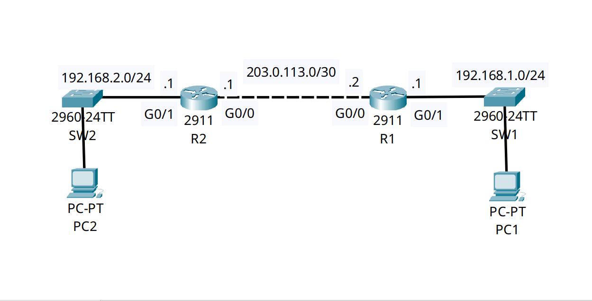

<div align="center">

# 🔄 Enterprise IP Management: Centralized DHCP & Cross-WAN Relay

[](https://cisco.com)
[](https://cisco.com)
[]()
[]()

<p align="center">
  <b>Scaling enterprise IP addressing by centralizing DHCP pools in the data center and utilizing branch routers as DHCP Relay Agents to forward UDP broadcasts across routed WAN links.</b>
</p>

</div>

---

## 📌 Executive Summary & Engineering Objective

In a large-scale enterprise or campus network, deploying and managing independent DHCP servers on every local subnet or branch edge router is administratively unscalable. The industry standard is to centralize DHCP services (often on dedicated IPAM servers or core routers) within the data center.

However, DHCP relies on Layer 2 broadcasts (`DHCP DISCOVER`), which routers drop by default. 

This lab demonstrates the **DHCP Relay** architecture:
1. **Centralized IP Management:** The core router (`R2`) holds multiple DHCP pools for various remote subnets and point-to-point transit links.
2. **Broadcast-to-Unicast Conversion:** The branch router (`R1`) acts as a **DHCP Relay Agent**. Using the `ip helper-address` command, it intercepts local DHCP broadcasts from PCs and encapsulates them into routable unicast UDP packets destined for the central server.
3. **Router DHCP Client:** Demonstrates edge interfaces securely leasing their own WAN IP addresses dynamically from upstream providers (`ip address dhcp`).

---

## 🗺️ Network Topology & Architecture

<div align="center">
  
</div>

---

## 📊 DHCP Scope & Relay Addressing Schema

| Server/Pool | Target Subnet | Default Gateway | Excluded IP Range | Domain Name |
| :--- | :--- | :--- | :--- | :--- |
| **R2: `POOL1`** | `192.168.1.0/24` | `192.168.1.1` (R1) | `.1` through `.10` | `abdulwahabsaim.github.io` |
| **R2: `POOL2`** | `192.168.2.0/24` | `192.168.2.1` (R2) | `.1` through `.10` | `abdulwahabsaim.github.io` |
| **R2: `POOL3`** | `203.0.113.0/30` | N/A (Transit Link) | `203.0.113.1` (R2) | N/A |

**Relay Mapping:** R1 (`Gig0/1`) intercepts broadcasts for `192.168.1.0/24` and relays them to **`203.0.113.1`**.

---

## 🛠️ Cisco IOS Configuration Highlights

### 🔹 R2: Centralized DHCP Server Configuration
```ios
! 1. Exclude static management IPs from the dynamic allocation pools
R2(config)# ip dhcp excluded-address 192.168.1.1 192.168.1.10
R2(config)# ip dhcp excluded-address 192.168.2.1 192.168.2.10
R2(config)# ip dhcp excluded-address 203.0.113.1

! 2. Create the Remote Branch Pool (POOL1)
R2(config)# ip dhcp pool POOL1
R2(config-dhcp)# network 192.168.1.0 255.255.255.0
R2(config-dhcp)# default-router 192.168.1.1
R2(config-dhcp)# dns-server 8.8.8.8
R2(config-dhcp)# domain-name abdulwahabsaim.github.io
```

### 🔹 R1: DHCP Relay Agent & Dynamic WAN Interface
```ios
! 1. Configure the Branch WAN Uplink to act as a DHCP Client
R1(config)# interface GigabitEthernet0/0
R1(config-if)# ip address dhcp
R1(config-if)# no shutdown

! 2. Configure the local LAN interface to act as a DHCP Relay Agent
R1(config)# interface GigabitEthernet0/1
R1(config-if)# ip address 192.168.1.1 255.255.255.0
R1(config-if)# ip helper-address 203.0.113.1
R1(config-if)# no shutdown
```

---

## 🔍 Verification & Operational Proof

### 1. Validating Centralized Leases on the Server (R2)
```text
R2# show ip dhcp binding
IP address       Client-ID/              Lease expiration        Type
                 Hardware address
192.168.1.12     0030.F238.8690           --                     Automatic
192.168.2.11     00E0.B087.76E5           --                     Automatic
203.0.113.2      0001.63B0.5601           --                     Automatic
```
*Validation:* The central server `R2` successfully leased `192.168.1.12` to a remote PC at the branch site, proving the `ip helper-address` on R1 is properly encapsulating and routing the DHCP D.O.R.A process across the WAN.

### 2. Validating the Edge Router Client Interface (R1)
```text
R1# show ip interface brief
Interface              IP-Address      OK? Method Status                Protocol 
GigabitEthernet0/0     203.0.113.2     YES DHCP   up                    up 
GigabitEthernet0/1     192.168.1.1     YES manual up                    up 
```
*Validation:* `Gig0/0` successfully obtained its public-facing transit IP (`203.0.113.2`) dynamically via the `DHCP` method.

---

## 🧰 NOC Diagnostic & Troubleshooting Cheat Sheet

| Diagnostic Command | Execution Mode | Incident Response Application |
| :--- | :--- | :--- |
| `show ip dhcp binding` | Privileged EXEC (`#`) | Displays all active MAC-to-IP leases. Critical for identifying IP conflicts or verifying a host's network assignment. |
| `show ip dhcp pool` | Privileged EXEC (`#`) | Verifies subnet utilization, identifying if a scope is exhausted and dropping new client requests. |
| `show ip interface [id]` | Privileged EXEC (`#`) | Confirms if an `ip helper-address` is actively applied to the gateway interface. |
| `clear ip dhcp binding *` | Privileged EXEC (`#`) | Flushes all active dynamic leases. Typically used after restructuring subnet boundaries or clearing stuck reservations. |

---

## ⚡ Key NOC Takeaway
**Under the Hood of `ip helper-address`:** When a router is configured with an IP helper, it doesn't just forward DHCP (UDP 67/68). By default, it acts as a UDP forwarding gateway for 8 specific UDP broadcast protocols, including TFTP (69), DNS (53), Time (37), NetBIOS Name Server (137), NetBIOS Datagram (138), and TACACS (49). In secure environments, engineers often restrict this using `no ip forward-protocol udp`.

---

## 📦 Included Artifacts

* `centralized-dhcp-relay-ip-helper.pkt` — Packet Tracer enterprise DHCP simulation.
* `topology.png` — Network topology diagram.
* `r2-config.ios` — Centralized DHCP server configuration with multiple IP scopes.
* `r1-config.ios` — Edge router configuration demonstrating DHCP Relay Agent behavior.
