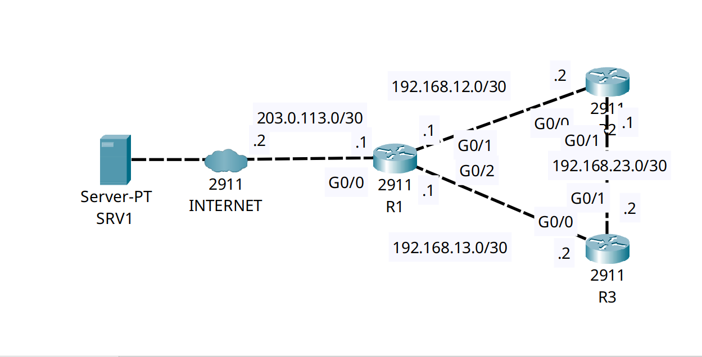

<div align="center">

# 🔄 Enterprise Time Synchronization: NTP Stratum Hierarchy & MD5 Authentication

[-00599C?style=for-the-badge&logo=cisco&logoColor=white)](https://cisco.com)
[](https://cisco.com)
[]()
[-orange?style=for-the-badge)]()

<p align="center">
  <b>Enforcing enterprise-wide chronological consistency across distributed infrastructure by implementing a hierarchical Network Time Protocol (NTP) design secured by MD5 cryptographic authentication.</b>
</p>

</div>

---

## 📌 Executive Summary & Engineering Objective

Accurate, unified time synchronization is not merely a convenience—it is a mandatory security and operational requirement across modern Network Operations Centers (NOC) and Security Operations Centers (SOC). Without synchronized clocks:
* **Log Correlation Fails:** Syslog incident reconstruction across multiple devices becomes impossible during troubleshooting or forensic investigation.
* **Security Tokens Break:** Digital certificates (X.509, TLS, IPsec IKEv2) fail validity checks if the local router clock falls outside the validity window.
* **Time-Shifting Attacks:** Untrusted NTP packets can be spoofed by attackers to bypass time-based Access Control Lists (ACLs) or force certificate expirations.

This lab implements a secure, resilient enterprise NTP distribution topology:
1. **Stratum Hierarchy:** An external Stratum 1 reference clock synchronizes the edge router (`R1`), which becomes a **Stratum 2** internal time master. Internal core/distribution routers (`R2`) sync to `R1`, operating at **Stratum 3**.
2. **Cryptographic Authentication:** Enforces **MD5 key verification** (`ntp authenticate`, `ntp trusted-key`) between peers, preventing rogue NTP servers from injecting fraudulent time packets.
3. **Hardware Calendar Updates:** Syncs the software clock to the battery-backed hardware calendar (`ntp update-calendar`) so accurate time persists across chassis power cycles.

---

## 🗺️ Network Topology & Architecture

<div align="center">
  
</div>

---

## 📊 Stratum Hierarchy & Security Schema

| Device | NTP Role | Reference Target | Local Stratum | MD5 Key ID | Hardware Calendar Sync |
| :--- | :--- | :--- | :--- | :--- | :--- |
| **External Server** | Authoritative Source | Atomic/GPS Reference (`127.127.1.1`) | **Stratum 1** | N/A | Active |
| **R1 (Edge)** | Border Client / Internal Master | `1.1.1.1` | **Stratum 2** | `Key 1` (Trusted) | Enabled (`update-calendar`) |
| **R2 (Core)** | Internal Client | `192.168.12.1` (`R1`) | **Stratum 3** | `Key 1` (Authenticated) | Enabled (`update-calendar`) |

---

## 🛠️ Cisco IOS Configuration Highlights

### 🔹 R1: Stratum 2 Border Master & Authentication Authority
```ios
! 1. Define and enable cryptographic MD5 authentication
R1(config)# ntp authentication-key 1 md5 CyberNocSecure123!
R1(config)# ntp authenticate
R1(config)# ntp trusted-key 1

! 2. Synchronize to external Stratum 1 server and declare internal master capability
R1(config)# ntp server 1.1.1.1
R1(config)# ntp master 7
R1(config)# ntp update-calendar
```

### 🔹 R2: Stratum 3 Internal Authenticated Client
```ios
! 1. Mirror identical key credentials and trust statement
R2(config)# ntp authentication-key 1 md5 CyberNocSecure123!
R2(config)# ntp authenticate
R2(config)# ntp trusted-key 1

! 2. Direct synchronization to R1 using Key 1 for packet validation
R2(config)# ntp server 192.168.12.1 key 1
R2(config)# ntp update-calendar
```

---

## 🔍 Verification & Operational Proof

### 1. R1 Stratum 2 Synchronization Validation
```text
R1# show ntp status
Clock is synchronized, stratum 2, reference is 1.1.1.1
nominal freq is 250.0000 Hz, actual freq is 249.9990 Hz, precision is 2**24
reference time is FFFFFFFFE369FAE6.000000EF (9:59:2.239 UTC Wed Dec 30 2020)
clock offset is 0.00 msec, root delay is 0.00  msec
root dispersion is 57.51 msec, peer dispersion is 0.12 msec.
```
*Validation:* `R1` has successfully locked onto `1.1.1.1`, showing `stratum 2` with a `0.00 msec` offset.

### 2. R1 Peer Associations & Reachability
```text
R1# show ntp associations

address         ref clock       st   when     poll    reach  delay          offset            disp
*~1.1.1.1       127.127.1.1     1    0        16      377    0.00           0.00              0.12
 ~127.127.1.1   .LOCL.          7    15       64      377    0.00           0.00              0.12
 * sys.peer, # selected, + candidate, - outlyer, x falseticker, ~ configured
```
*Validation:* 
* The `*` prefix denotes `1.1.1.1` as the active **system peer (`sys.peer`)**.
* The `reach 377` octal value (`11111111` binary) confirms that the last 8 consecutive polling queries successfully exchanged time packets without a single dropped response.

### 3. R2 Stratum 3 Authenticated Downstream Sync
```text
R2# show ntp status
Clock is synchronized, stratum 3, reference is 192.168.12.1
nominal freq is 250.0000 Hz, actual freq is 249.9990 Hz, precision is 2**24
reference time is FFFFFFFFE369FB06.000000D0 (9:59:34.208 UTC Wed Dec 30 2020)
clock offset is 3.00 msec, root delay is 0.00  msec
```

```text
R2# show ntp associations

address         ref clock       st   when     poll    reach  delay          offset            disp
*~192.168.12.1  1.1.1.1         2    9        16      377    0.00           3.00              0.12
```
*Validation:* `R2` has validated the MD5 hash on incoming packets from `192.168.12.1`, incremented its stratum to `stratum 3`, and achieved a healthy octal `reach 377` state.

---

## 🧰 NOC Diagnostic & Troubleshooting Cheat Sheet

| Diagnostic Command | Execution Mode | Incident Response Application |
| :--- | :--- | :--- |
| `show ntp status` | Privileged EXEC (`#`) | Instantly confirms if the clock is synchronized, reports local Stratum level, and displays clock offset/dispersion. |
| `show ntp associations` | Privileged EXEC (`#`) | Verifies peer reachability. Look for `*` (active peer) and an octal `reach` value climbing toward `377`. |
| `show ntp associations detail` | Privileged EXEC (`#`) | Displays cryptographic authentication state, packet counters, and authentication failure drops. |
| `show clock detail` | Privileged EXEC (`#`) | Shows current system timestamp and verifies if the time source is `NTP` vs `hardware calendar`. |

---

## ⚡ Key NOC Takeaway: Deciphering the `reach 377` Metric
In high-severity NOC incident management, junior engineers often assume an NTP association is working just because a server IP is listed. **Always inspect the `reach` column:**
* The value is displayed in **base-8 (octal)** representing an 8-bit shift register of the last 8 polls.
* A value of `0` means zero responses received.
* A value of `1` means only the first packet arrived (`00000001`).
* **`377`** (`11111111` binary) represents 100% reachability over the last 8 polling cycles. If `reach` drops below `377` or stays at `0`, investigate upstream firewall rules blocking **UDP port 123** or an **MD5 key mismatch**.

---

## 📦 Included Artifacts

* `ntp-stratum-hierarchy-authentication.pkt` — Packet Tracer time synchronization simulation.
* `topology.png` — Network topology diagram.
* `r1-config.ios` — Edge Router configuration (Stratum 2 master, calendar sync, MD5 key).
* `r2-config.ios` — Internal Router configuration (Stratum 3 authenticated client).
