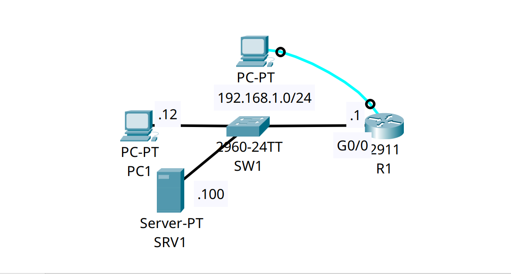

<div align="center">

# 🔄 Enterprise Network Telemetry: Centralized Syslog & Severity Levels (0–7)

[-00599C?style=for-the-badge&logo=cisco&logoColor=white)](https://cisco.com)
[](https://cisco.com)
[_➔_7_(Debug)-brightgreen?style=for-the-badge)]()
[]()

<p align="center">
  <b>Enforcing enterprise-grade visibility and event auditing by configuring millisecond-accurate timestamps, local circular RAM buffering, and forwarding facility traps to a centralized Syslog daemon.</b>
</p>

</div>

---

## 📌 Executive Summary & Engineering Objective

In an enterprise production network, reviewing incident logs locally on individual routers via console or SSH is unscalable and volatile (local RAM logs are permanently erased during reboots or power outages). Furthermore, security compliance standards (ISO 27001, SOC 2, PCI-DSS) mandate tamper-proof, off-device log retention.

This lab demonstrates the **Centralized Logging Architecture**:
1. **Millisecond Timestamping:** Configuring `service timestamps log datetime msec` so every event is stamped with sub-second accuracy for multi-device log correlation.
2. **Severity Hierarchy Management:** Understanding and configuring Cisco's 8 logging levels (0 through 7) to filter noise while ensuring critical state changes are captured.
3. **Remote Trap Forwarding:** Offloading facility logs across the network via **UDP port 514** to a dedicated centralized Syslog server (`192.168.1.100`), ensuring complete historical retention independent of local chassis state.

---

## 🗺️ Network Topology & Architecture

<div align="center">
  
</div>

---

## 📊 Cisco Syslog Severity Scale (0–7)

Understanding the severity numerical scale is a fundamental requirement for NOC triage and SIEM alarm thresholding:

| Level | Severity Name | Description | Operational Example | Trap Forwarded? |
| :---: | :--- | :--- | :--- | :---: |
| **`0`** | **Emergency** | System is completely unusable | Hardware bus panic, memory corruption | ✅ Yes |
| **`1`** | **Alert** | Immediate action required | Environmental overheating, power supply fail | ✅ Yes |
| **`2`** | **Critical** | Critical conditions | Core routing process failure | ✅ Yes |
| **`3`** | **Error** | Error conditions | Interface driver errors, crypto negotiation failure | ✅ Yes |
| **`4`** | **Warning** | Warning conditions | High memory threshold, redundant link flapping | ✅ Yes |
| **`5`** | **Notification**| Normal but significant state | Interface up/down (`%LINEPROTO-5-UPDOWN`), admin login | ✅ Yes |
| **`6`** | **Informational**| Routine informational messages| Server export started (`%SYS-6-LOGGINGHOST`) | ✅ Yes |
| **`7`** | **Debugging** | Detailed diagnostic output | Output generated by explicit `debug` commands | ✅ Yes (Configured) |

---

## 🔬 Dissecting the Cisco Syslog Message Format

Every standardized Cisco IOS log follows a strict anatomical structure:

$$\text{*Feb 28, 20:04:39.044: \%LINEPROTO-5-UPDOWN: Line protocol on Interface GigabitEthernet0/0, changed state to up}$$

* `*Feb 28, 20:04:39.044`: **Timestamp** with millisecond precision (`service timestamps`). The leading asterisk (`*`) indicates the clock is not yet synchronized to authoritative NTP.
* `%LINEPROTO`: **Facility Code** (identifies the hardware/software module; e.g., `SYS`, `LINEPROTO`, `OSPF`).
* `5`: **Severity Level** (`Notification` — normal, significant operational event).
* `UPDOWN`: **Mnemonic Code** (succinct identifier of the action).
* `Line protocol...`: **Message Body** (human-readable explanation of the state change).

---

## 🛠️ Cisco IOS Configuration Highlights

### 🔹 R1: Telemetry, Timestamps & Syslog Export
```ios
! 1. Enable millisecond precision for chronological event auditing
R1(config)# service timestamps log datetime msec

! 2. Configure the circular RAM buffer size (Retains logs locally in memory)
R1(config)# logging buffered 4096

! 3. Configure the remote Syslog daemon destination (UDP Port 514)
R1(config)# logging 192.168.1.100

! 4. Set the trap threshold to forward all events up to Debugging (Levels 0-7)
R1(config)# logging trap debugging
```

---

## 🔍 Verification & Operational Proof

### 1. Validating Syslog Subsystem Status (R1)
```text
R1# show logging
Syslog logging: enabled (0 messages dropped, 0 messages rate-limited,
          0 flushes, 0 overruns, xml disabled, filtering disabled)

    Console logging: level debugging, 3 messages logged
    Monitor logging: level debugging, 3 messages logged
    Buffer logging:  level debugging, 0 messages logged

    Trap logging: level debugging, 3 message lines logged
        Logging to 192.168.1.100  (udp port 514,  audit disabled,
             authentication disabled, encryption disabled, link up),
             3 message lines logged,
             0 message lines rate-limited,
             0 message lines dropped-by-MD
```
*Validation:* 
* Remote trap logging is operational and actively bound to external host `192.168.1.100` via `UDP 514`.
* `3 message lines logged` confirms packets are successfully egressing the router.
* `0 messages dropped` confirms the internal socket buffer is keeping pace with generated traps without buffer exhaustion.

### 2. Dissecting the Internal Log Buffer Events
```text
Log Buffer (4096 bytes):

*Feb 28, 20:04:39.044: %SYS-6-LOGGINGHOST_STARTSTOP: Logging to host 192.168.1.100 port 514 started - CLI initiated
*Feb 28, 20:04:39.044: %LINEPROTO-5-UPDOWN: Line protocol on Interface GigabitEthernet0/0, changed state to up
*Feb 28, 20:06:31.066: %SYS-5-CONFIG_I: Configured from console by console
```
*Validation:* 
* **Audit Trail:** Level 5 event `%SYS-5-CONFIG_I` captures the exact millisecond an administrator entered configuration mode from console.
* **Link State:** Level 5 event `%LINEPROTO-5-UPDOWN` captures the interface transition to operational state.

---

## 🧰 NOC Diagnostic & Troubleshooting Cheat Sheet

| Diagnostic Command | Execution Mode | Incident Response Application |
| :--- | :--- | :--- |
| `show logging` | Privileged EXEC (`#`) | Displays current logging destinations (console, monitor, buffer, host), drop counters, and dumps the circular RAM buffer. |
| `terminal monitor` | Privileged EXEC (`#`) | Enables real-time log printing to your current VTY/SSH terminal session (`logging monitor`). *Disabled by default on remote sessions.* |
| `terminal no monitor` | Privileged EXEC (`#`) | Silences terminal logging to stop active debugs from flooding an active SSH session. |
| `clear logging` | Privileged EXEC (`#`) | Clears the internal RAM buffer. Used before running a focused test or reproduction step. |

---

## ⚡ Key NOC Takeaway: The `terminal monitor` Trap
Junior engineers frequently log into a remote router via SSH, run a command that triggers a log event, and wonder why nothing appears on their screen. **By default, Cisco IOS sends live log messages ONLY to the physical RS-232 Console port.** To view real-time log messages over an SSH or Telnet session, the administrator must explicitly execute the **`terminal monitor`** command in EXEC mode for that session.

---

## 📦 Included Artifacts

* `centralized-syslog-telemetry.pkt` — Packet Tracer centralized logging simulation.
* `topology.png` — Network topology diagram.
* `r1-config.ios` — Edge Router configuration with millisecond timestamps and remote trap export
