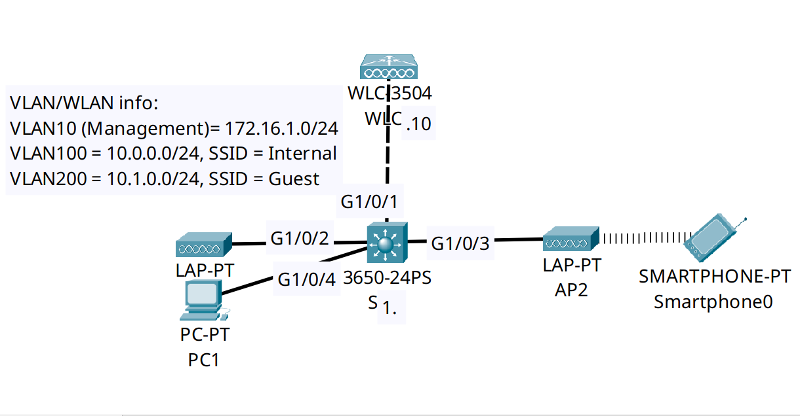

<div align="center">

# 🔄 Centralized Enterprise Wireless: Cisco 3504 WLC, CAPWAP & Lightweight APs

[](https://cisco.com)
[](https://cisco.com)
[-brightgreen?style=for-the-badge)]()
[]()

<p align="center">
  <b>Deploying a modern enterprise WLAN architecture using a centralized Cisco 3504 Wireless LAN Controller (WLC), Split-MAC processing over CAPWAP tunnels, and dynamic VLAN-to-SSID mapping.</b>
</p>

</div>

---

## 📌 Executive Summary & Engineering Objective

In enterprise campus environments, deploying standalone "Autonomous" (Fat) Access Points requires individual configuration and management per device, which does not scale. Modern campus deployments utilize a **Centralized / Split-MAC Architecture**:
* **Lightweight Access Points (LAPs):** Handle real-time Layer 1/2 RF operations (beacon frames, frame exchanges, signal quality monitoring, and 802.11 MAC headers).
* **Wireless LAN Controller (WLC):** Handles control and management functions centrally (association, EAP authentication, dynamic VLAN mapping, roaming, and RF power optimization).

This lab implements an enterprise wireless distribution block:
1. **Underlay Trunking & Native VLANs:** Configured an 802.1Q trunk between the Catalyst 3650 Multilayer Switch (`SW1`) and the Cisco 3504 WLC (`WLC1`), utilizing **Native VLAN 10** for untagged controller management traffic and tagged VLANs 100/200 for user traffic.
2. **Dynamic Interfaces:** Configured logical dynamic interfaces on the WLC bound to discrete 802.1Q VLAN IDs (`Internal` -> VLAN 100, `Guest` -> VLAN 200).
3. **WLAN & Security Deployment:** Broadcasted dual SSIDs utilizing **WPA2-Personal (AES)**, verifying that Lightweight APs successfully establish **CAPWAP (Control and Provisioning of Wireless Access Points)** tunnels to the controller and associate client devices.

---

## 🗺️ Network Topology & Architecture

<div align="center">
  
</div>

---

## 📊 WLC Interface & Logical WLAN Mapping Schema

| Interface Name | VLAN ID | IP Address / Mask | Gateway | Interface Role / Purpose | Dynamic AP Mgmt |
| :--- | :---: | :--- | :--- | :--- | :---: |
| **`management`** | `untagged` (`VLAN 10`) | `172.16.1.10 /24` | `172.16.1.1` | HTTPS GUI, SSH CLI & CAPWAP AP Discovery | **Enabled** |
| **`Internal`** | `VLAN 100` | `10.0.0.10 /24` | `10.0.0.1` | Internal Corporate Staff WLAN (`SSID: Internal`) | Disabled |
| **`Guest`** | `VLAN 200` | `10.1.0.10 /24` | `10.1.0.1` | Isolated Guest Internet Access (`SSID: Guest`) | Disabled |
| **`virtual`** | `N/A` | `192.0.2.1` | N/A | RFC 5737 Test IP for Guest Web-Auth & Roaming | Disabled |

---

## 🛠️ Cisco Catalyst 3650 Infrastructure Configuration

The Cisco 3504 WLC management interface expects **untagged** frames on its primary physical port. To achieve this, the connecting switchport must be configured as a trunk with the **Native VLAN matching the WLC Management VLAN**.

### 🔹 SW1: WLC Trunk Uplink & AP Access Ports
```ios
hostname SW1
!
! 1. Provision Campus VLANs
vlan 10
 name Management
vlan 100
 name Internal_WLAN
vlan 200
 name Guest_WLAN
!
! 2. Configure 802.1Q Trunk Uplink to WLC 3504 Port 1
interface GigabitEthernet1/0/1
 description ## Trunk to Cisco 3504 WLC Port 1 ##
 switchport trunk native vlan 10
 switchport trunk allowed vlan 10,100,200
 switchport mode trunk
 no shutdown
!
! 3. Configure Access Ports for Lightweight APs & Management Host
interface range GigabitEthernet1/0/2-4
 description ## Access Links to LAP1, LAP2, and Admin PC1 ##
 switchport mode access
 switchport access vlan 10
 switchport nonegotiate
 spanning-tree portfast
 no shutdown
!
! 4. Configure Layer 3 SVI Default Gateways
interface Vlan10
 description ## SVI: Management & AP Discovery ##
 ip address 172.16.1.1 255.255.255.0
 no shutdown

interface Vlan100
 description ## SVI: Internal Wireless Subnet ##
 ip address 10.0.0.1 255.255.255.0
 no shutdown

interface Vlan200
 description ## SVI: Guest Wireless Subnet ##
 ip address 10.1.0.1 255.255.255.0
 no shutdown
```

---

## 🔍 Verification & Operational Telemetry (WLC 3504 GUI)

The following operational metrics were validated through the Cisco 3504 Web Management Console (`https://172.16.1.10`):

### 1. Controller Health & Radio State
```text
Controller Model:           Cisco 3504 Wireless Controller
Software Version:           8.3.111.0
System Name:                WLC1
Management IP Address:      172.16.1.10 (Untagged on Native VLAN 10)
802.11a/n/ac Network State: Enabled
802.11b/g/n Network State: Enabled
Internal Temperature:      +31 C
CPU / Memory Usage:         0% / 46%
```

### 2. CAPWAP Access Point Join Status
```text
Access Point Summary:
  All APs Associated:       2 (LAP1, LAP2)
  802.11a/n/ac Radios Up:   2 of 2 (100% operational)
  802.11b/g/n Radios Up:   2 of 2 (100% operational)
  Active Wireless Clients:  1 (Associated via Smartphone)
```
*Validation:* Both Lightweight APs successfully discovered the controller over VLAN 10, completed DTLS negotiation, downloaded their run-time configurations over CAPWAP, and began beaconing both SSIDs.

### 3. WLC Interface Table Summary
```text
Interface Name    VLAN Identifier    IP Address      Interface Type    Dynamic AP Mgmt
----------------  -----------------  --------------  ----------------  ---------------
management        untagged           172.16.1.10     Static            Enabled
virtual           N/A                192.0.2.1       Static            Not Supported
Internal          100                10.0.0.10       Dynamic           Disabled
Guest             200                10.1.0.10       Dynamic           Disabled
```
*Validation:* The controller maintains dedicated Layer 3 boundaries for corporate and guest segments, mapping incoming CAPWAP client frames directly to their respective switch SVIs.

---

## 🧰 NOC Diagnostic & Troubleshooting Runbook

| Troubleshooting Topic | Operational Diagnostic & Resolution |
| :--- | :--- |
| **AP Fails to Join WLC** | Verify the AP obtained an IP via DHCP. Ensure **Dynamic AP Management** is enabled on the WLC `management` interface. Check Layer 2 broadcast reachability or verify **DHCP Option 43** in multi-subnet environments. |
| **Native VLAN Mismatch** | The WLC management interface expects **untagged** frames by default. If `switchport trunk native vlan 10` is missing on switch port `Gig1/0/1`, the switch tags VLAN 10, causing the WLC to drop all management and CAPWAP packets. |
| **Why `192.0.2.1` Virtual IP?** | The virtual interface uses an unroutable RFC 5737 address solely for client-facing operations: Layer 3 web authentication (Captive Portals) and intra-controller roaming handoffs. It must never exist as a real route on the network. |
| **PortFast on AP Links** | Switchports connected to Lightweight APs (`Gig1/0/2-3`) must have `spanning-tree portfast` enabled. If STP takes 30–50 seconds to transition to forwarding, the AP may time out during its DHCP discovery cycle. |

---

## ⚡ Key NOC Takeaway: The CAPWAP Tunnel Ports
In an enterprise network, traffic passing between the LAP and WLC is encapsulated in **CAPWAP UDP frames**:
* **UDP Port 5246:** CAPWAP Control (Encrypted control channel used for management, channel selection, and transmission power).
* **UDP Port 5247:** CAPWAP Data (Encapsulates user payload frames from the AP to the controller).
If an intermediate firewall or ACL blocks UDP ports 5246/5247, APs will continuously reboot and cycle through discovery without ever reaching the `Joined` state.

---

## 📦 Included Artifacts

* `enterprise-wlc-centralized-wireless.pkt` — Completed Cisco Packet Tracer wireless simulation.
* `topology.png` — Network topology diagram.
* `sw1-config.ios` — Catalyst 3650 Multilayer Switch configuration provisioning trunking, Native VLANs, and wireless SVIs.
